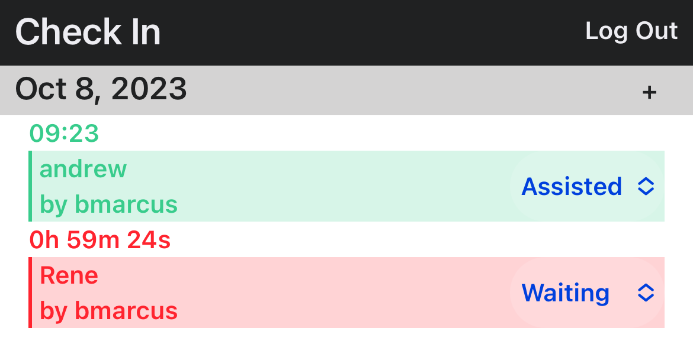

# Check-In-Tool 🚗

A sophisticated React/GraphQL-based application designed for on-site teams to efficiently manage and monitor queues at check-in desks. Built using the MERN (MongoDB, Express.js, React, Node.js) stack for optimal performance and scalability.



## Table of Contents

1. [Features](#features)
2. [Installation](#installation)
3. [Usage](#usage)
4. [Support](#support)
5. [Contributing](#contributing)
6. [Copyright Notice](#copyright)

## Features

- **Real-time Queue Monitoring**: View current queue status and expected wait times.
- **Easy Check-In Process**: Simplified interface for quickly checking in customers.
- **Mobile Responsive**: Built in a mobile-first mindset since this app will be used with phones and tablets at the front desk

## Installation

### Prerequisites

- [Node.js](https://nodejs.org/)
- [MongoDB](https://www.mongodb.com/try/download/community)

### Steps

1. Clone the repository:

```bash
git clone git@github.com:blakee-marcus/Check-In-Tool.git
```

2. Navigate to the project directory:

```bash
cd Check-In-Tool
```

3. Install the necessary dependencies for both server and client:

```bash
npm run install
```

## Usage

1. To start the application in development mode (both client and server will run concurrently):

```bash
npm run develop
```

Client will be running at: `http://localhost:3000`  
Server will be running at: `http://localhost:3001`

## Support

For any issues or queries, please reach out to the team:

- Blake (Project Lead): `bmarcus@tesla.com`

## Contributing

We welcome contributions! Please see our [Contribution Guidelines](./ReadMe-Assets/Contributions.md) for more details.

## Copyright

All rights reserved. This software and related documentation are copyrighted material, owned by me. Unauthorized copying, distribution, public performance, or display is strictly prohibited without written permission by the author.

